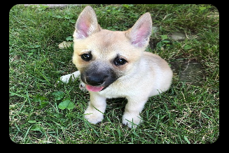
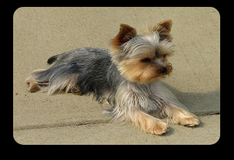

# MMM-Dogs
If you like dogs?  This module shows you random pictures of dogs.

#Examples:

 







You can decide how often the picture changes:

**Example:**
```
{
    disabled: false,
    module: 'MMM-Dogs',
    position: 'top left',
    config: { 
        updateInterval: 180 * 60 * 1000 
    }
},
